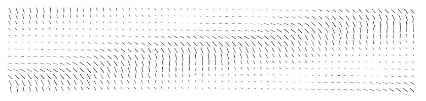
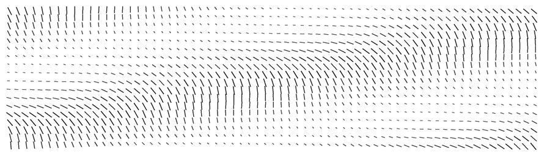

&nbsp;&nbsp;
&nbsp;&nbsp;

---

<table>
<tr><td>

I build things across the stack — systems infrastructure at AWS, data pipelines in Python, user-facing products in React. I lead data education at Harvard, develop product with real clients, and choreograph for the Asian American Dance Troupe.

**Harvard College '29** — Computer Science + Economics + Data Analytics in Sociology  
**Texas Academy of Mathematics & Science '25** — Visual Arts & Design

</td></tr>
</table>

---

<h3 align="center">Experience</h3>

| | Role | When |
|---|---|---|
|  | **SDE Intern**, [AWS ElastiCache](https://aws.amazon.com/elasticache/) | Summer 2026 |
|  | **Director of Education**, [Harvard Data Analytics Group](https://www.harvardanalytics.org/) | 2025 – |
|  | **Director of Consulting**, [Harvard Product Lab](https://www.hcsproductlab.org/) | 2025 – |
|  | **Undergraduate Research Fellow**, [University of North Texas BME](https://engineering.unt.edu/bme/research/labs/arm/index.html) | 2023 – 2025 |

---

<h3 align="center">Projects</h3>

<table>
<tr>
<td width="50%" valign="top">

**[valkey-ci-agent](https://github.com/BChan-0/valkey-ci-agent)**  
CI tooling for Valkey — Python-based test infrastructure for the caching engine behind AWS ElastiCache.

</td>
<td width="50%" valign="top">

**[hurcg](https://github.com/BChan-0/Love-and-Deliverables)**  
(1) Visual novel game engine infrastructure for Unity & (2) Satirical C# Unity visual novel game based on Harvard College's undergraduate consulting club culture.

</td>
</tr>
<tr>
<td width="50%" valign="top">

**[product-lab-react](https://github.com/BChan-0/product-lab-react-transfer)**  
Ground-up rebuild of the Harvard Product Lab website in React/Vercel.

</td>
<td width="50%" valign="top">

**[gacha-data](https://github.com/BChan-0/GenshinGachaData)**  
Probability analysis of Genshin Impact gacha mechanics using public pull data. Built for a curated seminar taught for HAUSCR's Harvard Summit for Young Leaders in China.

</td>
</tr>
</table>

---

<h3 align="center">Tech Stack</h3>

**Languages**

**Frameworks & Libraries**

**Infrastructure & Tools**

**Design & 3D**

---

<h3 align="center">Now</h3>

☁️ Interning with **AWS ElastiCache** — open-source Valkey infrastructure  
📊 Leading workshops and curriculum at **HDAG**  
💃 Choreographing for **Asian American Dance Troupe**

---

